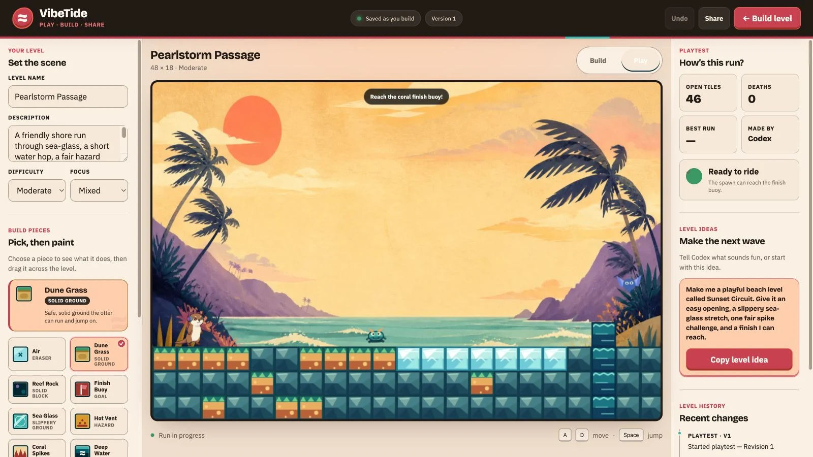
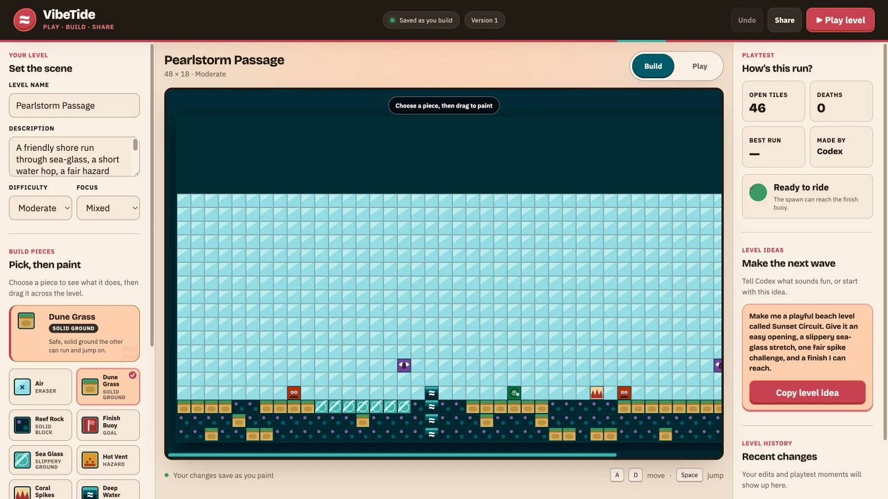

# VibeTide Live

**Play it. Build it. Share the tide.**

VibeTide Live is a colorful 2D platformer and instant level maker. Run, jump, dodge reef creatures, paint your own route, or ask a visiting agent to build one from a plain-English idea. Every change lands in the same playable level—no exports, rebuilds, or chatbot panel required.

[](https://vibetide-live.banjtheman.chatgpt.site)
[](https://github.com/banjtheman/vibe_tide_live/actions/workflows/ci.yml)
[](LICENSE)

The repository also includes the complete, reproducible source for the 2:16
[WebMCP Challenge competition video](video/README.md), including genuine app
captures, timed narration, captions, audio mastering, and upload materials.

## Play now

[Launch the public game](https://vibetide-live.banjtheman.chatgpt.site), press **Play level**, and guide the headphone-wearing otter to the finish buoy. Use the arrow keys or WASD to move, Space to jump, or the touch controls on mobile.



## Play, build, share

- **Play:** Tackle side-scrolling routes with slippery sea glass, water, vents, spikes, patrolling reef crawlers, flying swell-wings, and projectile-firing tide-spitters.
- **Build:** Switch to Build mode, choose from ten illustrated backdrops, paint tiles directly, edit the level’s name and style, validate the route, or undo a change.
- **Share:** Copy one compact URL that opens the same level directly in Play mode—no account, JSON download, or server save required.
- **Create with an agent:** In a WebMCP-capable browser, describe the experience you want. The agent can build, validate, playtest, repair, and share it using the tools exposed by the page.

Try this:

> Build me a moderate VibeTide level called Sunset Circuit. Start friendly, introduce slippery sea-glass platforms, add one fair spike challenge and all three enemy types, keep the finish reachable, then start a playtest.

The game also works as a normal website when WebMCP is unavailable; every player-facing build and play control remains usable by hand.

## The builder



The editor describes each tile’s behavior before you paint it: dune grass and reef rock are solid ground, sea glass is slippery, hot vents, coral spikes, and deep water are hazards, and enemy markers place distinct encounters. Agent edits and human edits share one revision history, so both collaborators always see the same state.

## What is inside

- Deterministic blueprint-to-level generation with runs, gaps, stairs, ice, water, hazards, and a reachable finish
- Phaser 3 side-scrolling play with Arcade physics, coyote time, jump buffering, ice momentum, camera follow, keyboard input, and touch controls
- An eight-frame idle, run, jump, and fall animation atlas for the upright V1 headphone otter
- Ten original level backdrops, from Golden Coast and Neon Moonwave to Kelp Cathedral and Starlight Tidepool
- Three enemy families: ground-patrolling reef crawlers, flying swell-wings, and ranged tide-spitters with full-travel projectiles
- Structural and reachability validation, atomic tile patches, revision history, and undo
- Playtest reports with completion, elapsed time, deaths, recent events, and death clustering
- Responsive, high-contrast editing and play surfaces for desktop and mobile
- Short, classic, long, or exact level dimensions with seafloor-anchored resizing and one-step undo
- A compact, versioned `vt2.` level format for shareable URLs, with backward-compatible `vt1.` imports

## WebMCP

VibeTide registers eleven structured tools directly on the page: agents can inspect and generate levels, resize the course, apply precise patches, edit metadata, change the visual background, validate reachability, start and review playtests, undo changes, and create share links. Inputs use narrow JSON Schemas plus runtime validation, while the agent and visual editor operate on the same `LevelStore` snapshot.

See [the WebMCP implementation notes](docs/WEBMCP.md) for the complete tool contract, tile IDs, safety boundaries, and local test harness.

## Run locally

Requirements: Node.js 22.13.0 or newer. No API key, database, or backend service is required.

```bash
git clone https://github.com/banjtheman/vibe_tide_live.git
cd vibe_tide_live
npm ci
npm run dev
```

Open `http://localhost:4173/`.

Run the full verification suite and production build:

```bash
npm run check
npm run build
npm run preview
```

`npm run check` runs TypeScript checks, unit tests, and the production build.

## Architecture

```text
Human editor ─┐
              ├─> LevelStore ─> frozen snapshot ─> editor + Phaser scene
WebMCP tools ─┘       │                              │
                     ├─> validator + undo            └─> playtest events
                     └─> vt2 URL codec <──────────────────────┘
```

- `src/core` contains framework-free level state, generation, validation, telemetry, persistence, and encoding.
- `src/webmcp` contains the standards-facing tool layer and independent input validators.
- `src/game` contains the Phaser runtime, enemies, input, and physics integration.
- `src/ui` contains the human workbench and visual tile editor.

Levels persist in the browser’s local storage. A share action serializes the current level into the URL, so opening that URL reconstructs the shared snapshot and starts it in Play mode without uploading anything to a backend. The recipient can switch to Build to remix it. Playtest telemetry stays local unless a user deliberately shares its result through their agent conversation.

Shared links also expose the level name and description to social preview crawlers while using a consistent V1-inspired VibeTide card. Search engines index the main game rather than every encoded level variation.

## Compatibility

WebMCP is experimental. The editor and game run in ordinary modern browsers; the agent tool surface activates only when `document.modelContext` is available. The implementation follows the current [WebMCP draft](https://webmachinelearning.github.io/webmcp/) and OpenAI’s [site-tools guide](https://learn.chatgpt.com/docs/webmcp).

## Art and licensing

The ten backdrops, character, animation atlas, and social artwork were created for VibeTide Live with OpenAI ImageGen; the production otter redraw preserves the project’s original upright V1 character and purple headphones. Enemy art is drawn procedurally in Phaser. Generation details and source provenance are documented in [docs/ART.md](docs/ART.md).

Source code is available under the [MIT License](LICENSE). Original and generated art assets have separate terms in [ASSET_LICENSE.md](ASSET_LICENSE.md).

## Project notes

- [Hackathon strategy and demo script](docs/HACKATHON.md)
- [WebMCP implementation notes](docs/WEBMCP.md)
- [Art direction and provenance](docs/ART.md)

For the project’s earlier agent-assisted iteration, see the [original VibeTide MCP repository](https://github.com/banjtheman/vibe_tide_mcp).
